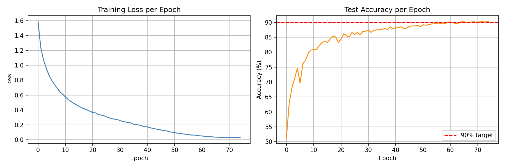
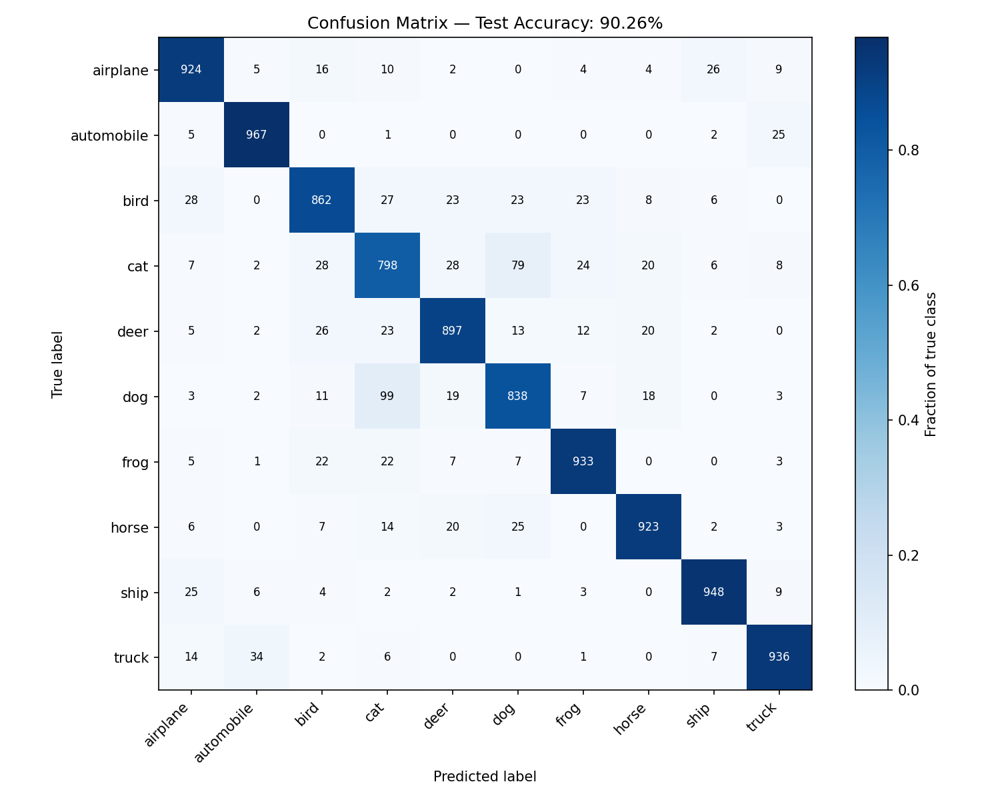
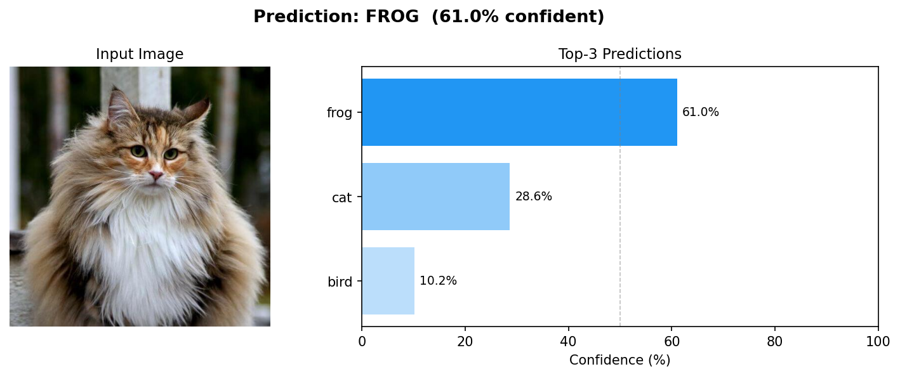

# CIFAR-10 Image Classifier

A convolutional neural network built from scratch in PyTorch, using OpenCV for image preprocessing, trained on the CIFAR-10 dataset. Achieves **90.26% test accuracy** across 10 classes.

---

## Results

### Training Curves — 75 epochs

Accuracy crosses the 90% target line around epoch 65 and holds.



### Confusion Matrix

Matrix across all 10 classes. The known weak spot is between **cat - dog** analysis (798 and 838 correct respectively) — a structural limitation of 32×32 resolution where fine-grained features like whiskers and snout shape are lost during resize.



| Class | Accuracy |
|---|---|
| Automobile | 96.7% |
| Ship | 94.8% |
| Frog | 93.3% |
| Horse | 92.3% |
| Airplane | 92.4% |
| Truck | 93.6% |
| Deer | 89.7% |
| Bird | 86.2% |
| Dog | 83.8% |
| **Cat** | **79.8%** |

---

## Example

Single-image prediction with top-3 confidence scores. Norwegian Forest Cat fed in — the dense fur texture collapses to a mottled blob at 32×32, causing the model to favour frog (similar texture profile) over cat. Domain shift at low resolution.



---

## Web App

A minimal Flask app for uploading or pasting images and viewing predictions in the browser.

**Supports:** file upload · drag & drop · Ctrl+V paste from clipboard

```
python app.py
# open http://127.0.0.1:5000
```

---

## Architecture

```
Input (3 × 32 × 32)
  │
  ├─ Block 1: Conv2d(3→32)   + BN + ReLU + MaxPool  →  (32 × 16 × 16)
  ├─ Block 2: Conv2d(32→64)  + BN + ReLU + MaxPool  →  (64 × 8 × 8)
  ├─ Block 3: Conv2d(64→128) + BN + ReLU            →  (128 × 8 × 8)
  ├─ Block 4: Conv2d(128→256) × 2 + BN + ReLU + MaxPool → (256 × 4 × 4)
  │
  └─ Classifier: Flatten → Linear(4096→512) → Dropout(0.5)
                         → Linear(512→256)  → Dropout(0.3)
                         → Linear(256→10)
```

**Training config:** Adam · lr 0.001 · Cosine LR schedule · Weight decay 1e-4 · 75 epochs · Batch size 64

**Augmentation:** RandomHorizontalFlip · RandomCrop(32, padding=4)

---

## Stack

- PyTorch + torchvision
- OpenCV (preprocessing pipeline)
- Flask (web interface)
- matplotlib (evaluation plots)

## File Structure

| File | Purpose |
|---|---|
| `stage1_data_loading.py` | CIFAR-10 download + DataLoader setup |
| `stage2_preprocessing.py` | OpenCV preprocessing + augmentation |
| `stage3_cnn.py` | CNN model definition |
| `stage4_training.py` | Training loop with LR schedule |
| `stage5_evaluation.py` | Confusion matrix + per-class accuracy |
| `stage6_inference.py` | Single-image inference script |
| `app.py` | Flask web application |
